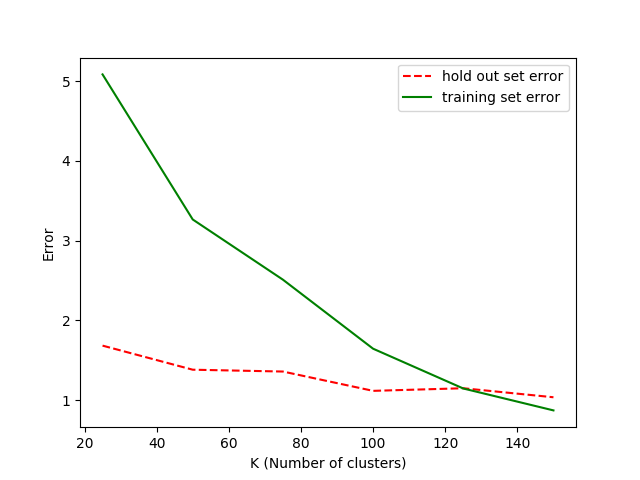
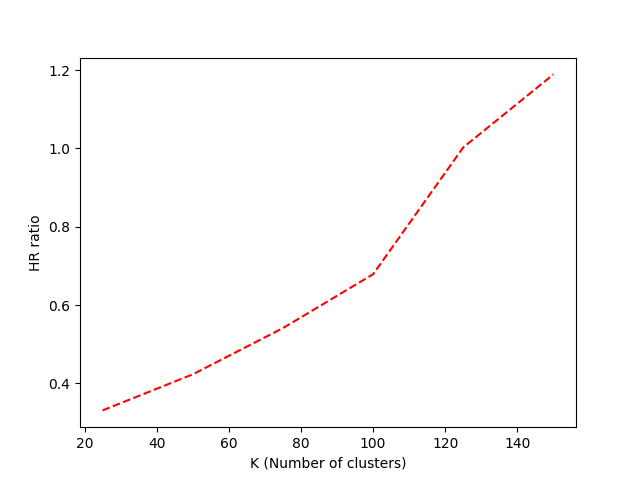
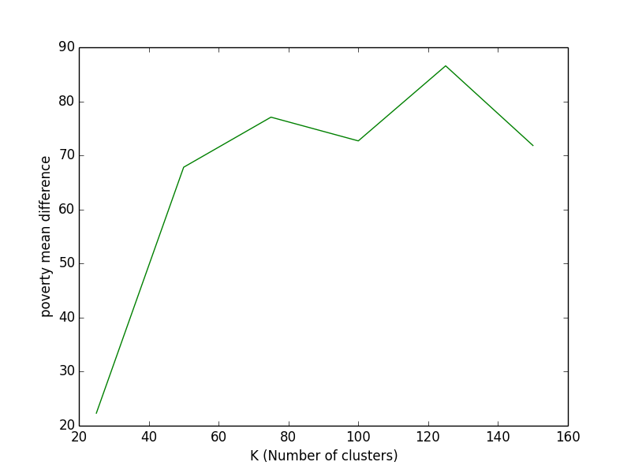
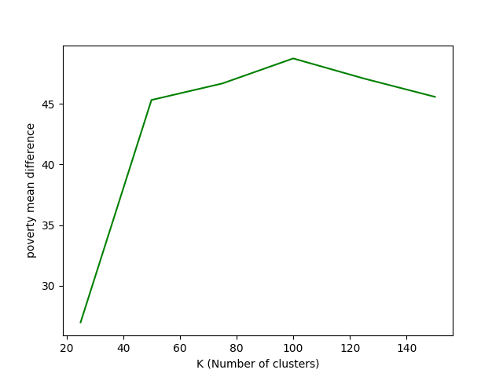
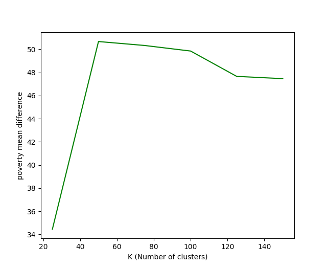

 ## Problem 1: Removed Error

#### Defination:

* **Training**: Use a set of data to training the Algorithem to get cluster as we wanted.

* **Training set**: A set containing a number of points randomly choosen from all points.
* **Holdout set**: All points subtract **Training set**.

* **Error**: Squared Distance between points from cluster and centroid of cluster.

Some explanation

Some Explanation

## Problem 3: Prediction error

#### Definition 

* **Error**: Differences between average of poverty of clusters and average poverty of all points to it's nearest cluster.

Figure 1: only poverty set to be 0 to make sure it didn't interfere the prediction

Figure 2: I randomly set propertys other then poverty to 0 or 1 while keeping poverty 0. after 50 times runing the clustering algorithem, I found the following may be best in this test.
**Properties**: HomeValue2000	Income1999	Poverty1999	PopDensity2000	PopChange	Prcnt65+	Below18	PrcntFemale2000	PrcntHSgrads2000	PrcntCollege2000	Unemployed	PrcntBelow18	LifeExpectancy	FarmAcres
**Weight applied**: [1 0 0 1 1 0 1 1 0 1 1 0 0 1]

Figure 3:

**Weight applied**: [0 0 0 0 0 1 1 0 0 0 0 1 0 1]

